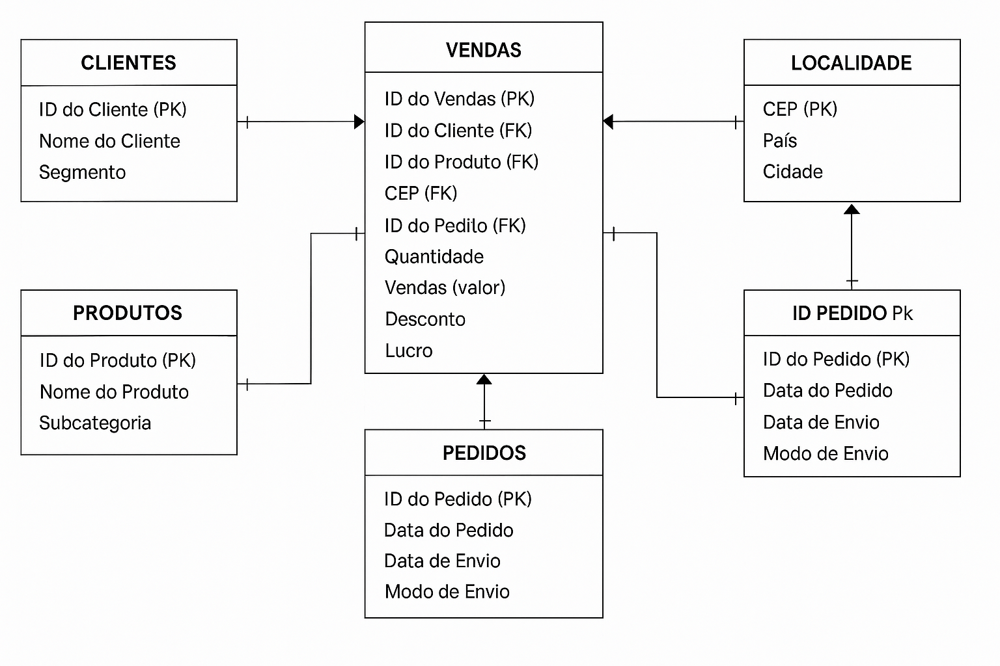
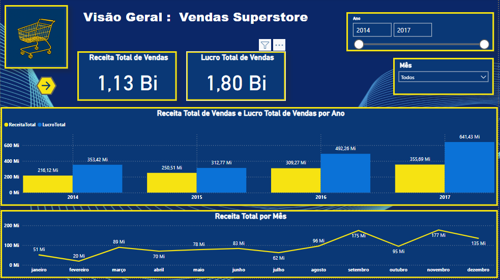
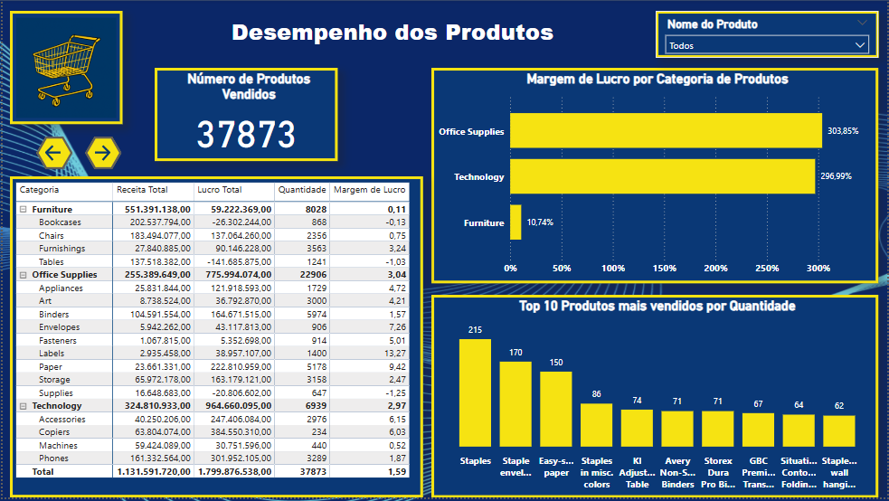

# 🛒 Análise de Vendas de um Superstore - Projeto em Power BI 

## 📖 Introdução

Este é um projeto **pessoal de análise de dados**, desenvolvido com o objetivo de **praticar e aplicar conhecimentos em Power BI**, abrangendo desde o **processo de ETL (Extração, Transformação e Carga)** até a **modelagem e criação de visualizações interativas**.

O projeto foi inteiramente construído dentro do Power BI, utilizando o **dataset "Sample Superstore Sales Data"**, amplamente conhecido e disponível publicamente no Kaggle:  
🔗 [Link para o dataset no Kaggle](https://www.kaggle.com/datasets/vivek468/superstore-dataset-final)

A ideia central é simular uma situação de análise real de dados de vendas de um **supermercado/e-commerce**, respondendo a **perguntas de negócio fictícias**, mas plausíveis, com foco no aprendizado de técnicas de análise, modelagem de dados e visualização.

## 🎯 Objetivo do Projeto

O principal objetivo deste projeto é realizar uma análise exploratória e descritiva dos dados de vendas, com foco em:

✅ Explorar métricas de desempenho de vendas.  
✅ Analisar a segmentação de clientes e seus impactos.  
✅ Avaliar a eficiência operacional, como o tempo médio entre pedido e envio.  
✅ Desenvolver visualizações intuitivas e interativas que facilitem a tomada de decisão.

O projeto foi **totalmente implementado no Power BI**, utilizando:  
- Power Query para a **transformação e limpeza dos dados**.  
- Modelo Estrela para **organização e relacionamento entre tabelas**.  
- Dashboards e relatórios interativos para **apresentação dos insights**.

Todas as análises, modelagens e visualizações foram feitas **sem o uso de outras ferramentas externas**, reforçando o domínio completo da ferramenta.

---

## ❓ Perguntas de Negócio que Guiaram a Análise

Durante o desenvolvimento, diversas **questões estratégicas** foram elaboradas para nortear a exploração dos dados:

1. **Qual é a receita total e o lucro por ano/mês?**  
2. **Quais categorias de produtos possuem a maior margem de lucro?**  
3. **Quais estados e regiões apresentam o melhor desempenho em vendas?**  
4. **Qual é o tempo médio entre o pedido e o envio?**  
5. **Existem clientes recorrentes? Qual é o impacto deles nas vendas?**

---

**🔔 Observação:**  
Todas as perguntas, análises e interpretações realizadas são **fictícias** e têm como principal finalidade a **simulação de um cenário realista** para **fins de aprendizado e desenvolvimento de competências na área de análise de dados**.

## 🛠️ Processos de ETL e Modelagem dos Dados

Este projeto foi inteiramente desenvolvido no **Power BI Desktop**, desde a importação e transformação dos dados até a criação do modelo e dashboards. Todas as etapas foram cuidadosamente realizadas para garantir uma análise precisa e eficiente.

---

## 1️⃣ Importação dos Dados

O processo iniciou com a importação do dataset:

1. Abra o Power BI Desktop.
2. Selecione a opção **"Obter Dados"** > **"Texto/CSV"**.
3. Navegue até o arquivo: `Sample_Superstore_Sales.csv`.
4. Revise a pré-visualização e clique em **"Carregar"**.

---

## 2️⃣ Cópia da Tabela Original

Antes de realizar qualquer transformação ou limpeza, foi criada uma **cópia da tabela original**.  

✅ A tabela original foi mantida **sem alterações**, garantindo a integridade para futuras consultas ou validações.  

✅ Todas as transformações, limpezas e análises foram realizadas a partir da **cópia da tabela**.  

**Exemplo de nomeação:**
- `Sample_Superstore_Original` → **Não alterada**  
- `Sample_Superstore_Tratada` → **Usada para as transformações**  

---

## 3️⃣ Transformação, Limpeza e Análise Exploratória

As transformações foram realizadas utilizando o **Power Query**, com a **Linguagem M**, incluindo as seguintes etapas principais:

---

### ✅ Tradução dos Cabeçalhos

Para facilitar a interpretação e o desenvolvimento da análise, todos os nomes das colunas foram traduzidos do inglês para o português, utilizando o seguinte código M:  

    ```m
    // Tradução dos cabeçalhos, para melhor entendimento
    #"Cabeçalhos Traduzidos" = Table.RenameColumns(#"Cabeçalhos Promovidos", {
        {"Row ID", "ID da Linha"},
        {"Order ID", "ID do Pedido"},
        {"Order Date", "Data do Pedido"},
        {"Ship Date", "Data de Envio"},
        {"Ship Mode", "Modo de Envio"},
        {"Customer ID", "ID do Cliente"},
        {"Customer Name", "Nome do Cliente"},
        {"Segment", "Segmento"},
        {"Country", "País"},
        {"City", "Cidade"},
        {"State", "Estado"},
        {"Postal Code", "CEP"},
        {"Region", "Região"},
        {"Product ID", "ID do Produto"},
        {"Category", "Categoria"},
        {"Sub-Category", "Subcategoria"},
        {"Product Name", "Nome do Produto"},
        {"Sales", "Vendas"},
        {"Quantity", "Quantidade"},
        {"Discount", "Desconto"},
        {"Profit", "Lucro"}
    })
    ´´´m
---

### ✅ Ajuste de Tipos de Dados  

Após a tradução dos cabeçalhos, foi realizado o ajuste dos tipos de dados para garantir a correta análise e visualização:

- `Data do Pedido` → Tipo **Data** (formato: **Português - BR**).  
- `Data de Envio` → Tipo **Data** (formato: **Português - BR**).  
- `Vendas` → Tipo **Número Decimal**.  
- `Lucro` → Tipo **Número Decimal**.  
- `Quantidade` → Tipo **Número Inteiro**.  
- `Desconto` → Tipo **Número Decimal** (ajuste de localidade).  
- `ID da Linha` → Tipo **Número Inteiro**.

---

### ✅ Verificação de Valores Nulos

O próximo passo na transformação e limpeza dos dados foi verificar a existência de valores nulos ou faltantes nas colunas do dataset.

Essa verificação foi realizada utilizando as próprias funcionalidades do Power BI Desktop, no editor do Power Query, que permite identificar rapidamente linhas ou colunas com dados ausentes.

- Colunas analisadas para valores nulos incluíram:  
  `ID do Pedido`, `Data do Pedido`, `Data de Envio`, `Vendas`, `Lucro`, entre outras importantes para a análise.

- Caso fossem encontrados valores nulos, o plano seria tratá-los conforme a necessidade (remoção, substituição, imputação), porém, neste dataset, não foram identificados valores nulos significativos, o que facilitou o prosseguimento da análise.

---
### ✅ Verificação de Duplicatas e Inconsistências nos Dados

Após verificar que **não havia valores nulos** no dataset, o próximo passo foi realizar uma análise para identificar possíveis **duplicatas ou inconsistências** nos dados, com foco na integridade da base para garantir análises confiáveis.

Durante essa análise, foram identificados dois problemas importantes:

---

#### 🚨 Problema 1: Nomes de Produtos Iguais para IDs de Produtos Diferentes

- Foi identificado que alguns **nomes de produtos** se repetiam, mas estavam associados a **IDs de produtos diferentes**.
- Esse tipo de inconsistência pode indicar erro de cadastro, divergência no sistema de origem ou problemas na integração dos dados.
- **Impacto**: pode gerar distorções nas análises relacionadas a vendas por produto e categoria.

**Exemplo hipotético:**  
| ID do Produto | Nome do Produto        |
|---------------|-----------------------|
| PROD123       | Cadeira Executiva X   |
| PROD789       | Cadeira Executiva X   |

---

#### 🚨 Problema 2: IDs de Produtos Iguais para Nomes de Produtos Diferentes

- Também foi detectado o inverso: **mesmos IDs de produto** associados a **nomes diferentes de produtos**.
- Isso é ainda mais grave, pois indica uma falha no controle de identificação única de produtos.
- **Impacto**: pode comprometer severamente as análises de performance de produtos, inventário e vendas.

**Exemplo hipotético:**  
| ID do Produto | Nome do Produto        |
|---------------|-----------------------|
| PROD456       | Impressora Laser A     |
| PROD456       | Impressora Multifuncional B |

---

### ✅ Ações Planejadas

- **Analisar a origem dessas inconsistências**, verificando se são erros sistemáticos ou casos isolados.
- **Definir critérios de tratamento**, como:
  - Unificação de registros duplicados.
  - Correção manual ou automática com base em regras de negócio.
  - Comunicação com a área responsável pelo cadastro de produtos.
 
---

### ✅ Tratamento das Inconsistências - Decisões e Ações

Como este é um **projeto pessoal com foco em aprendizado**, foi decidido adotar as seguintes medidas para **corrigir as inconsistências identificadas**:

---

#### 🛠️ Caso 1: Mesmos Nomes para Diferentes IDs de Produto

**Problema identificado:**  
- O mesmo **nome de produto** aparecia vinculado a **diferentes IDs de produto**.

**Decisão:**  
- **Padronizar os IDs de produto**, unificando todos os registros com o **mesmo nome** sob um **único ID**.

**Critério adotado:**  
- Para cada nome duplicado, foi selecionado o **primeiro ID de ocorrência** como o **ID principal**.
- Todos os registros com o mesmo nome foram atualizados para utilizar esse **ID principal**.

**Exemplo de ação:**

| Antes                               |
|--------------------------------------|
| PROD123 → Cadeira Executiva X       |
| PROD789 → Cadeira Executiva X       |

| Depois                              |
|--------------------------------------|
| PROD123 → Cadeira Executiva X       |
| PROD123 → Cadeira Executiva X       |

**Ferramenta utilizada:**  
- Esta padronização foi realizada diretamente no **Power Query**, utilizando o recurso de **mesclagem de consultas** e **coluna condicional** para substituir os IDs conforme a regra estabelecida.

---
#### 🛠️ Implementação da Solução - Caso 1

Para resolver o problema de **mesmos nomes de produtos com diferentes IDs**, foi criada uma **tabela auxiliar** no **Power Query** para identificar esses casos e gerar a informação do **ID padrão** para cada nome duplicado.

**Passos realizados:**

1. **Agrupar** os dados por `Nome do Produto` e **listar** todos os `IDs distintos` associados a cada nome.
2. **Filtrar** apenas os casos onde há **mais de um ID** para o mesmo nome.
3. **Criar uma coluna** com o **ID padrão**, que corresponde ao **primeiro ID registrado** para aquele nome.
4. Utilizar essa tabela auxiliar para **substituir os IDs** nos dados principais.

---

**Código M utilizado para criar a tabela auxiliar:**

    ```m
    let
        Fonte = #"Sample - Superstore - Copia",
    
        // Agrupar por nome e contar IDs distintos
        NomesComProblemas = Table.Group(Fonte, {"Nome do Produto"}, {
            {"IDsDistintos", each List.Distinct([ID do Produto]), type list},
            {"Contagem", each List.Count(List.Distinct([ID do Produto])), type number}
        }),
    
        // Filtrar apenas nomes com problemas
        NomesProblematicos = Table.SelectRows(NomesComProblemas, each [Contagem] > 1),
        #"IDsDistintos Expandido" = Table.ExpandListColumn(NomesProblematicos, "IDsDistintos"),
    
        // Criar ID padrão para os IDs diferentes com o mesmo nome de produto
        // Para o ID padrão usamos o primeiro ID registrado para o nome do produto
        NomesProblematicosComIDPadrao = Table.AddColumn(NomesProblematicos, "IDPadrao", each List.First([IDsDistintos]))
    in
        NomesProblematicosComIDPadrao
    ´´´m

---

#### 🛠️ Mesclagem e Correção dos IDs - Caso 1

Após identificar os **valores problemáticos** com a **tabela auxiliar**, foi realizada uma **mesclagem** com a **tabela original copiada**, a fim de:

✅ Trazer o **ID padrão** para cada registro com problemas.  
✅ Criar uma **nova coluna condicional** chamada **"ID Produto Final"**, contendo:  
- O **ID corrigido** para os produtos que apresentavam inconsistência.  
- O **ID original** para os produtos que não precisavam de correção.

---

**Passos realizados:**

1. **Mesclar** a tabela original (`Sample - Superstore - Copia`) com a tabela `IDsProblematicos` utilizando a coluna `Nome do Produto`.
2. **Expandir** a coluna `IDPadrao` da tabela mesclada.
3. Criar a coluna **"ID Produto Final"** com uma **condição**:  
   - Se houver um `IDPadrao`, então usá-lo.  
   - Caso contrário, manter o `ID do Produto` original.
4. **Reordenar** as colunas para melhor organização.

---

**Código M utilizado para mesclagem e criação da coluna condicional:**

    ```m
    // Mescla da tabela original com a tabela de IDs problemáticos
    // Correção do ID de produto na coluna "ID Produto Final"
    
    let
        Fonte = Table.NestedJoin(
            #"Sample - Superstore - Copia", 
            {"Nome do Produto"}, 
            IDsProblematicos, 
            {"Nome do Produto"}, 
            "IDsProblematicos", 
            JoinKind.LeftOuter
        ),
    
        #"IDsProblematicos Expandido" = Table.ExpandTableColumn(
            Fonte, 
            "IDsProblematicos", 
            {"IDPadrao"}, 
            {"IDsProblematicos.IDPadrao"}
        ),
    
        ColunaIDFinal = Table.AddColumn(
            #"IDsProblematicos Expandido", 
            "ID Produto Final", 
            each if [IDsProblematicos.IDPadrao] = null then [ID do Produto] else [IDsProblematicos.IDPadrao]
        ),
    
        #"Colunas Reordenadas" = Table.ReorderColumns(
            ColunaIDFinal,
            {
                "ID da Linha", "ID do Pedido", "Data do Pedido", "Data de Envio", 
                "Modo de Envio", "ID do Cliente", "Nome do Cliente", "Segmento", 
                "País", "Cidade", "Estado", "CEP", "Região", "ID do Produto", 
                "ID Produto Final", "Nome do Produto", "Categoria", "Subcategoria", 
                "Vendas", "Quantidade", "Desconto", "Lucro", "IDsProblematicos.IDPadrao"
            }
        )
    in
        #"Colunas Reordenadas"
    ´´´m
    
---

#### ✅ Conclusão da Solução - Caso 1

Com a aplicação das etapas descritas, foi possível **solucionar o primeiro problema**: a existência de **diferentes IDs para o mesmo nome de produto**.

Através da **criação da tabela auxiliar**, **mesclagem** e **padronização do ID**, os dados agora apresentam uma **estrutura consistente e confiável**, permitindo análises mais precisas.

---

### 🚩 Próximo Passo: Tratamento do Problema 2

Agora seguiremos para o **segundo problema identificado** na análise de qualidade dos dados:

> **Produtos com o mesmo ID, mas associados a nomes diferentes.**

Este tipo de inconsistência também compromete a integridade das análises e exige uma abordagem adequada para **padronizar as informações**.

---

## 🛠️ Caso 2: Mesmo ID de Produto para Nomes Diferentes

### Problema identificado:

O mesmo **ID de produto** aparecia vinculado a **nomes de produtos diferentes**, indicando um potencial erro de cadastro ou inconsistência nos dados.

---

### Decisão:

Como se trata de um **projeto de aprendizado**, optou-se por realizar uma **ajuste técnico** para garantir a consistência da base de dados.

---

### Critério adotado:

- Para cada **ID duplicado** (ou seja, associado a nomes distintos), foi mantido o **primeiro nome** de ocorrência vinculado ao ID original.
- Para os demais nomes associados ao mesmo ID, o ID foi **ajustado**, adicionando-se o valor do **índice** ao **último dígito** do ID original, evitando assim repetições.

---

### Exemplo de ação:

**Antes**  
PROD123 → Cadeira Executiva X  
PROD123 → Mesa de Reunião Y  

**Depois**  
PROD123 → Cadeira Executiva X  
PROD124 → Mesa de Reunião Y  

---

### Ferramenta utilizada:

Esta correção foi realizada diretamente no **Power Query**, utilizando:

- Criação de uma **tabela auxiliar** para identificar todos os casos de **IDs compartilhados entre nomes diferentes**.
- Utilização de um **índice** para numerar cada nome associado ao mesmo ID.
- Definição de uma **regra de ajuste**:  
  ➡️ O **primeiro nome** mantém o ID original.  
  ➡️ Os **demais nomes** recebem uma variação no ID original, **somando o índice ao último dígito**.

---

### 🛠️ Código M para criação da tabela auxiliar

        ```m
        // Tabela de nomes problemáticos: nomes diferentes para o mesmo ID de produto
        // A tabela mostra os nomes e IDs com problemas e cria um índice para cada nome diferente com o mesmo ID
        
        let
            Fonte = #"Sample - Superstore - Copia",
        
            // Agrupar por ID e contar nomes distintos
            IDsComProblemas = Table.Group(
                Fonte, 
                {"ID do Produto"}, 
                {
                    {"NomesDistintos", each List.Distinct([Nome do Produto]), type list},
                    {"Contagem", each List.Count(List.Distinct([Nome do Produto])), type number}
                }
            ),
        
            // Filtrar apenas IDs com problemas
            IDsProblematicos = Table.SelectRows(IDsComProblemas, each [Contagem] > 1),
        
            // Expandir os nomes distintos para análise
            #"NomesDistintos Expandido" = Table.ExpandListColumn(IDsProblematicos, "NomesDistintos"),
        
            // Classificar as linhas por ID e Nome
            #"Linhas Classificadas" = Table.Sort(
                #"NomesDistintos Expandido",
                {{"ID do Produto", Order.Descending}, {"NomesDistintos", Order.Descending}}
            ),
        
            // Agrupar novamente por ID, mantendo a lista de nomes
            #"Linhas Agrupadas" = Table.Group(
                #"Linhas Classificadas", 
                {"ID do Produto"}, 
                {{"Dados", each _, type table [ID do Produto=nullable text, NomesDistintos=text, Contagem=number]}}
            ),
        
            // Criar um índice para os nomes diferentes com o mesmo ID
            // Exemplo: ID1 → nome1 = índice 0, nome2 = índice 1, e assim por diante
            CriandoIndice = Table.TransformColumns(
                #"Linhas Agrupadas",
                {"Dados", each Table.AddIndexColumn(_, "Índice", 0, 1, Int64.Type)}
            ),
        
            // Expandir novamente para visualização e uso posterior
            #"Dados Expandido" = Table.ExpandTableColumn(
                CriandoIndice, 
                "Dados", 
                {"ID do Produto", "NomesDistintos", "Índice"}, 
                {"Dados.ID do Produto", "Dados.NomesDistintos", "Dados.Índice"}
            )
        in
            #"Dados Expandido"
        ´´´m

---

## 🛠️ Continuação da Solução do Problema 2: Mesclagem e Ajuste Final dos IDs

### Objetivo:

Realizar a **mesclagem** entre a tabela já ajustada na **Solução do Problema 1** e a **tabela auxiliar** criada na **Solução do Problema 2**.  
Em seguida, criar uma **coluna condicional** que implementa a **regra final de correção** dos IDs, garantindo que:

- O primeiro nome relacionado a um mesmo ID permanece com o ID original.
- Os demais nomes com o mesmo ID recebem um **ID ajustado**, conforme o índice criado anteriormente.

---

### Processo realizado:

1. **Mescla** da tabela mesclada do problema 1 (`Consulta2`) com a tabela auxiliar `NomesProdutosProblematicos`.
2. **Criação de coluna condicional** (`Novo ID Produto`) que aplica a regra de ajuste:
   - Se não há problema, mantém o `ID Produto Final`.
   - Se há problema e o índice é `0`, mantém o `ID Produto Final`.
   - Se há problema e o índice é maior que `0`, cria um novo ID adicionando o índice ao **último dígito do ID**.

---

### 🛠️ Código M para mesclagem e ajuste final:

        ```m
        // Mescla 2: Mescla da tabela ajustada no problema 1 com a tabela de nomes problemáticos
        // Cria a coluna condicional para ajustar IDs repetidos com nomes diferentes
        
        let
            Fonte = Table.NestedJoin(
                Consulta2, 
                {"ID Produto Final", "Nome do Produto"}, 
                #"NomesProdutosProblematicos", 
                {"ID do Produto", "Dados.NomesDistintos"}, 
                "NomesProdutosProblematicos", 
                JoinKind.LeftOuter
            ),
        
            #"NomesProdutosProblematicos Expandido" = Table.ExpandTableColumn(
                Fonte, 
                "NomesProdutosProblematicos", 
                {"Dados.ID do Produto", "Dados.NomesDistintos", "Dados.Índice"}, 
                {
                    "NomesProdutosProblematicos.Dados.ID do Produto", 
                    "NomesProdutosProblematicos.Dados.NomesDistintos", 
                    "NomesProdutosProblematicos.Dados.Índice"
                }
            ),
        
            // Coluna condicional que aplica a regra de ajuste de ID
            #"Coluna Condicional Adicionada" = Table.AddColumn(
                #"NomesProdutosProblematicos Expandido", 
                "Novo ID Produto", 
                each 
                    if [#"NomesProdutosProblematicos.Dados.ID do Produto"] = null then
                        [ID Produto Final]
                    else
                        if [#"NomesProdutosProblematicos.Dados.Índice"] = 0 then
                            [ID Produto Final]
                        else
                            let
                                prefixo = Text.Start(
                                    [#"NomesProdutosProblematicos.Dados.ID do Produto"], 
                                    Text.Length([#"NomesProdutosProblematicos.Dados.ID do Produto"]) - 5
                                ),
                                sufixoNum = Number.FromText(
                                    Text.End([#"NomesProdutosProblematicos.Dados.ID do Produto"], 5)
                                ) + [#"NomesProdutosProblematicos.Dados.Índice"],
                                novoID = prefixo & Text.PadStart(Text.From(sufixoNum), 5, "0")
                            in
                                novoID
            )
        in
            #"Coluna Condicional Adicionada"
        ´´´m

---

## ✅ Conclusão das Soluções dos Problemas e das Transformações e Limpeza dos dados

Com estas duas etapas, os problemas de inconsistência nos IDs de produtos foram totalmente solucionados.

Agora, temos a tabela final de Vendas da Superstore completa, limpa e padronizada, pronta para:

- Criar os relacionamentos no Power BI.
- Construir o esquema estrela para modelagem dos dados.
- Desenvolver as análises e visualizações interativas nos dashboards.

Este é o ponto de partida para gerar insights confiáveis e consistentes com base em dados organizados e corrigidos.

---

## 4️⃣ Modelagem das Tabelas com Esquema Estrela

No próximo passo, realizaremos a modelagem das tabelas utilizando o **esquema estrela**, criando os relacionamentos entre a tabela de fatos (tabela principal de vendas) e as tabelas de dimensões (segmentadas).

### Por que utilizar o esquema estrela e segmentar a tabela principal?

- **Melhoria na performance:** A segmentação da tabela principal em tabelas de dimensão e fato reduz a redundância e otimiza a velocidade das consultas no Power BI.
- **Facilidade na análise:** Permite uma organização lógica dos dados, facilitando a criação de filtros, segmentações e análises dinâmicas.
- **Manutenção simplificada:** Alterações e atualizações nas dimensões ou na tabela de fatos podem ser feitas de forma independente.
- **Criação de dashboards eficientes:** Com o esquema estrela, os relacionamentos são mais claros e a construção de relatórios interativos torna-se mais ágil e intuitiva.

A modelagem correta é fundamental para garantir uma análise consistente, ágil e confiável dos dados de vendas, servindo como base para todas as visualizações e insights que serão desenvolvidos.

---

## 🗂️ Esquema do Modelo de Dados Relacional

### **Diagrama**



---

## 📄 Descrição das Tabelas e Relacionamentos

### **VENDAS**

| Campo            | Tipo     | Descrição                                     |
| ---------------- | -------- | --------------------------------------------- |
| ID do Vendas     | PK       | Identificador único da venda                  |
| ID do Cliente    | FK       | Relaciona com tabela CLIENTES                 |
| ID do Produto    | FK       | Relaciona com tabela PRODUTOS                 |
| CEP              | FK       | Relaciona com tabela LOCALIDADE               |
| ID do Pedido     | FK       | Relaciona com tabela PEDIDOS                  |
| Quantidade       | Numérico | Quantidade de produtos vendidos               |
| Vendas (valor)   | Numérico | Valor total da venda                          |
| Desconto         | Numérico | Desconto aplicado                             |
| Lucro            | Numérico | Lucro obtido com a venda                       |

---

### **CLIENTES**

| Campo           | Tipo  | Descrição                            |
| --------------- | ----- | ------------------------------------ |
| ID do Cliente   | PK    | Identificador único do cliente       |
| Nome do Cliente | Texto | Nome completo do cliente             |
| Segmento        | Texto | Segmento ao qual o cliente pertence  |

**Relacionamento:** 1:N com VENDAS

---

### **PRODUTOS**

| Campo           | Tipo  | Descrição                            |
| --------------- | ----- | ------------------------------------ |
| ID do Produto   | PK    | Identificador único do produto       |
| Nome do Produto | Texto | Nome do produto                      |
| Subcategoria    | Texto | Subcategoria do produto              |
| Categoria       | Texto | Categoria do produto                 |

**Relacionamento:** 1:N com VENDAS

---

### **LOCALIDADE**

| Campo  | Tipo  | Descrição                              |
| ------ | ----- | -------------------------------------- |
| CEP    | PK    | Código de Endereçamento Postal         |
| País   | Texto | País de origem                         |
| Estado | Texto | Estado de origem                       |
| Região | Texto | Região do país                         |
| Cidade | Texto | Cidade de origem                       |

**Relacionamento:** 1:N com VENDAS

---

### **PEDIDOS**

| Campo           | Tipo  | Descrição                            |
| --------------- | ----- | ------------------------------------ |
| ID do Pedido    | PK    | Identificador único do pedido        |
| Data do Pedido  | Data  | Data em que o pedido foi realizado   |
| Data de Envio   | Data  | Data em que o pedido foi enviado     |
| Modo de Envio   | Texto | Modalidade de envio escolhida        |

**Relacionamento:** 1:N com VENDAS

---

## 🔗 Resumo dos Relacionamentos

- CLIENTES → VENDAS: 1:N (1 para Muitos)
- PRODUTOS → VENDAS: 1:N (1 para Muitos)
- LOCALIDADE → VENDAS: 1:N (1 para Muitos)
- PEDIDOS → VENDAS: 1:N (1 para Muitos)

---

## ✅ Benefícios dessa estrutura

✅ Eliminação de redundância  
✅ Melhoria na integridade referencial  
✅ Facilidade de manutenção e expansão  
✅ Separação clara de domínios de dados  

---

## 5️⃣ Criação das Medidas DAX

Após a modelagem do banco e a criação dos relacionamentos entre as tabelas, o próximo passo foi a construção de **Medidas DAX**. Essas medidas permitem realizar cálculos dinâmicos e análises avançadas nos dashboards.

As principais medidas criadas foram:

- **Total de Vendas**  

  ```dax
      ReceitaTotal = SUM(VENDAS[Vendas])
  
  
- **Lucro Total**

  ```dax
      LucroTotal = SUM(VENDAS[Lucro])
  

- **Margem de Lucro**

  ```dax
      MargemLucro = DIVIDE([LucroTotal], [ReceitaTotal], 0)
  
- **Quantidades Vendidas**

  ```dax
      QuantidadeVendida = SUM(VENDAS[Quantidade])

- **Tempo de Entrega**  
  Foi criada uma **coluna calculada** na tabela **PEDIDOS**.  
  Cálculo da diferença em dias entre a data do pedido e a data de envio.

  ```dax
      TempoEntrega = DATEDIFF(PEDIDOS[Data do Pedido], PEDIDOS[Data de Envio], DAY)

- **Tempo Médio de Entrega**  
  Foi o tempo médio de entrega calculado na coluna calculada anteriormente.

    ```dax
        TempoMédioEntrega = AVERAGE(PEDIDOS[TempoEntrega])

- **Colunas Calculadas na Tabela CLIENTES**  

Para responder a uma das perguntas de negócio, foram criadas **duas colunas calculadas** na tabela **CLIENTES**:  

1️⃣ **Total de Compras**  
Conta o total de compras realizadas por cada cliente, utilizando a função `RELATEDTABLE`.

    ```dax
        Total de Compras = COUNTROWS(RELATEDTABLE(VENDAS))
        
- **Colunas Calculadas na Tabela CLIENTES**  

Para responder a uma das perguntas de negócio, foram criadas **duas colunas calculadas** na tabela **CLIENTES**:  

1️⃣ **Total de Compras**  
Conta o total de compras realizadas por cada cliente, utilizando a função `RELATEDTABLE`.

    ```dax
        Total de Compras = COUNTROWS(RELATEDTABLE(VENDAS))

2️⃣ **Tipo de Cliente**  
Classifica o cliente como **"Recorrente"** ou **"Novo"**, com base no total de compras.

    ```dax
    Tipo de Cliente = 
        IF(
            CLIENTES[Total de Compras] > 2,
            "Recorrente",
            "Novo"
        )
                )

Para estabelecer um parâmetro para definirmos quais clientes são novos e quais são recorrentes, como é um projeto com fins de aprendizado, decidimos optar que:

- Clientes com mais de duas compras no loja são considerados **clientes recorrentes**;
- Clientes com duas ou menos compras são considerados **clientes novos**.

Mas o ideal, em um contexto real, é consultar a área de negócio e checar qual o parâmetro condicional adequado para a situação.

A partir das colunas calculadas anteriormente, fizemos mais 3 novas medidas que serão utilizadas:

1. **Receita de Vendas Não Recorrentes (Novas):**

    ```dax
    Vendas Não Recorrentes = 
    CALCULATE(
        SUM(VENDAS[Vendas]),
        FILTER(
            CLIENTES,
            CLIENTES[Tipo de Cliente] = "Novo"
        )
    )

2. **Receita de Vendas Recorrentes**

    ```dax
    Vendas Recorrentes = 
    CALCULATE(
        SUM(VENDAS[Vendas]),
        FILTER(
            CLIENTES,
            CLIENTES[Tipo de Cliente] = "Recorrente"
        )
    )
    
3.**% de Vendas Recorrentes:**

    ```dax
    % Vendas Recorrentes = 
    DIVIDE([Vendas Recorrentes], SUM(VENDAS[Vendas]), 0)


Agora, com todas as medidas DAX devidamente criadas, podemos passar para a próxima etapa, que é a criação dos dashboards em si.

## 📊 6️⃣ Dashboards e Análise de Resultados

Nesta etapa, foram desenvolvidos **5 dashboards interativos** no Power BI, cada um com foco em responder às perguntas de negócio definidas anteriormente. Abaixo estão os detalhes dos principais painéis:

---

### 🖥️ **Dashboard 1: Visão Geral de Vendas**
**Objetivo:** Analisar desempenho global e tendências temporais.
Onde será respondido a seguinte pergunta de negócio: **Qual é a Receita Total e Lucro por ano/mês ?**

**Visualizações principais:**
- 📊 Gráfico de Barras: Receita Total e Lucro Total de Vendas por Ano
- 📈 Gráfico de linhas: Variação da Receita de Vendas mensais
- 🏷️ Cartões KPIs: 
  - Receita Total: `R$ 1,13Bi` 
  - Lucro Total: `1,80Bi`

**Principais Análises:**
- 🔍 2017: Foi o ano com maior Receita e Lucros da empresa (que apresentou uma evolução crescente durante os anos)
- 📌 Os principais mês que se destacaram em Receita de Vendas foi o mês de **Setembro** e **Novembro**

Todos os Gráficos são interativos, podendo ser alterado o mês e ano para obter análises mais detalhadas.

### **Dashboard Visão Geral Vendas**



---

### 🖥️ **Dashboard 2: Desempenho dos Produtos**
**Objetivo:** Analisar desempenho dos produtos por categorias  
**Visualizações principais:**
- 📊 Gráfico de Barras Horizontais: Mostrando a Margem de Lucro por Categoria de Produtos.
- 📊 Gráfico de Barras Verticais: Mostrando os Top 10 Produtos masi Vendidos por Quantidade.
- 📋 Matriz: Mostra a Receita total, Lucro Total, Quantidade Vendida e Margem de Lucro para cada categoria e suas subcategorias, permitindo uma análise mais profunda.
- 🏷️ Cartões KPIs: 
  - Número de Produtos Vendidos: `37873` produtos 

**Principais Análises:**
- 🔍 Office Supplies (Materiais de Escritório): Foi a categoria de produtos que teve a maior margem de Lucro, seguido da categoria de Tecnologias.
- 🔍 Os 10 produtos mais Vendidos estão justamente relacionados a categoria de Materiais de Escritório
- 🔍 Podemos notar ainda pela Matriz que a categoria de Forniture (Móveis), apresentou a Maior Receita, mas obteve a Menor margem de Lucro entre as categorias.
- 📌 O número de produtos Vendidos foi de 37873 produtos

Todos os Gráficos são interativos, podendo ser alterado pelo nome de um produto específico para obter análises mais detalhadas.

### **Dashboard Desempenho dos Produtos**


